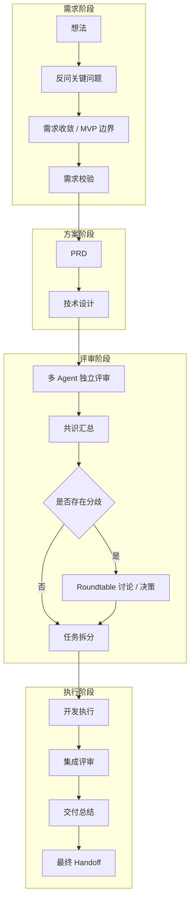

# AegisFlow 项目分析报告

## 项目概览

**定位**：多智能体协作 CLI 编排工具  
**核心理念**：将原始想法自动推进为完整的 PRD、技术设计、评审记录，并调度本地开发工具链完成交付  
**开源协议**：ISC License  
**当前版本**：1.0.4  
**Star 数**：49（新项目，2026-03-16 创建）  
**Fork 数**：5  
**主要语言**：TypeScript（100%）  
**仓库地址**：https://github.com/williamnie/aegisFlow

---

## 核心架构

### 1. 技术栈

**运行时**：
- Node.js >= 18
- TypeScript 5.9.3
- CommonJS 模块系统

**核心依赖**：
- `@clack/prompts` - 交互式 CLI 界面
- `chalk` - 终端样式
- `cli-spinners` - 加载动画
- `node-pty` - 伪终端（用于调度外部 CLI）
- `dotenv` - 环境变量管理

**构建工具**：
- `esbuild` - 快速打包
- `tsx` - TypeScript 执行器

### 2. 目录结构

```
src/
├── adapters/           # AI 引擎适配器层
│   ├── base.ts        # 适配器基类
│   ├── acp-wrapper.ts # 进程包装器
│   └── cli-strategies.ts # CLI 调用策略
├── engine/            # 核心引擎
│   └── consensus.ts   # 共识引擎
├── store/             # 状态持久化
├── ui/                # 用户界面
├── config.ts          # 配置管理
├── orchestrator.ts    # 核心编排器
├── schemas.ts         # JSON Schema 定义
├── types.ts           # TypeScript 类型
└── index.ts           # 入口文件
```

### 3. 支持的 AI 引擎

当前支持 3 个 AI CLI：
- **Claude** (`claude`)
- **Codex** (`codex`)
- **Gemini** (`gemini` / `gemini-cli`)

每个引擎有不同的专长定位：
- **Claude**：架构边界、长链路权衡
- **Codex**：后端实现、数据流、测试可维护性
- **Gemini**：前端体验、交互设计、产品打磨

---

## 核心工作流（8 阶段）

### Stage 0: 想法整理与需求闸门
- 引导用户输入原始想法
- 生成结构化追问（最少但必要）
- 收敛 MVP 边界
- **输出**：`idea-brief.md`

### Stage 0.5: 需求校验
- 需求复杂度评估（low/medium/high）
- 需求清晰度判断（clear/needs_confirmation/needs_clarification）
- 多 Agent 独立验证
- **输出**：`requirement-pack.md`、`requirement-validation.md`

### Stage 1: PRD 生成
- 基于需求包生成产品需求文档
- **输出**：`prd.md`（写入当前工作目录）

### Stage 2: 技术设计
- 生成技术设计文档
- **输出**：`design.md`（写入当前工作目录）

### Stage 3: 独立评审
- 多 Agent 并行独立评审设计
- 每个 Agent 从自己的专长视角审查
- 评审结果包含：verdict（Approve/Needs Discussion/Reject）、findings、openQuestions
- **输出**：各 Agent 的评审报告

### Stage 4: 共识汇总与圆桌决策
- 汇总评审结果，提取共识点和冲突点
- 如果存在分歧，自动启动圆桌讨论（Roundtable）
- 多轮对话直到达成决策
- **输出**：`consensus-report.md`、`roundtable-minutes.md`

### Stage 4.5: 开发策略选择
- 用户选择推进方式：
  - 单终端顺序执行
  - 多终端并行协作
  - 暂停，稍后继续

### Stage 5: 任务拆分
- 生成任务依赖图（TaskGraph）
- 按领域分类（frontend/backend/architecture/integration/testing/data/docs/ops）
- **输出**：`implementation-plan.md`

### Stage 6: 开发执行
- 调度本地 AI CLI 执行任务
- 逐任务记录执行日志
- 支持任务级评审
- **输出**：`task-runs/` 目录下的执行记录

### Stage 7: 集成评审与交付
- 集成评审
- 生成交付总结
- 最终 handoff
- **输出**：`integration-review.md`、`delivery-summary.md`、`final-handoff.md`

---

## 工作流程图



---

## 核心数据结构

### IdeaBrief（想法摘要）
```typescript
{
  rawIdea: string;
  targetUsers: string;
  goals: string[];
  constraints: string[];
  nonGoals: string[];
  successCriteria: string[];
  assumptions: string[];
  followUps: string[];
}
```

### RequirementAssessment（需求评估）
```typescript
{
  summary: string;
  complexity: 'low' | 'medium' | 'high';
  clarity: 'clear' | 'needs_confirmation' | 'needs_clarification';
  reasoning: string;
  keyRisks: string[];
  missingInformation: string[];
  recommendedQuestions: string[];
  shouldConfirmSummary: boolean;
  shouldDelegateValidation: boolean;
  nextStep: RequirementNextStep;
}
```

### StructuredReview（结构化评审）
```typescript
{
  reviewer: EngineSlot;
  lens: string;  // 评审视角
  verdict: 'Approve' | 'Needs Discussion' | 'Reject';
  summary: string;
  findings: ReviewFinding[];
  openQuestions: string[];
  suggestedDecision: string;
}
```

### ConsensusIssue（共识问题）
```typescript
{
  id: string;
  question: string;
  whyItMatters: string;
  options: ConsensusIssueOption[];
}
```

### TaskGraph（任务图）
```typescript
{
  tasks: TaskNode[];
  // TaskNode 包含：id, domain, dependencies, description
}
```

---

## 核心特性

### 1. 多智能体协作
- **独立评审**：每个 Agent 从自己的专长视角独立审查
- **共识引擎**：自动提取共识点和冲突点
- **圆桌机制**：分歧时自动启动多轮讨论
- **角色分工**：架构/后端/前端三个视角互补

### 2. 会话持久化
- 所有会话数据存储在 `~/.aegisflow/sessions/<session-id>/`
- 支持中断后恢复（`aegis <session-id>`）
- 支持从任意阶段重新开始（`aegis <session-id> --from <stage>`）
- Session ID 格式：`<dir1>-<dir2>-<timestamp>`

### 3. 产物管理

**工作目录产物**（最终交付）：
- `prd.md`
- `design.md`
- `prd-review.md` / `prd-revised.md`（评审模式）
- `design-review.md` / `design-revised.md`（评审模式）

**归档产物**（`~/.aegisflow/sessions/<session-id>/archive/`）：
- `idea-brief.md`
- `requirement-pack.md`
- `consensus-report.md`
- `roundtable-minutes.md`
- `implementation-plan.md`
- `integration-review.md`
- `delivery-summary.md`
- `final-handoff.md`
- `task-runs/` - 逐任务执行记录

### 4. 灵活的路由配置
```json
{
  "routing": {
    "designLead": "codex",
    "fallbackOrder": ["codex", "claude", "gemini"]
  }
}
```

### 5. 快捷评审命令
- `/reviewp @prd.md` - 直接评审现有 PRD
- `/reviewd @design.md` - 直接评审现有设计文档
- 支持相对/绝对路径，支持空格路径

### 6. 超时控制
- 默认模型执行超时：30 分钟
- 可通过 `config.json` 的 `timeouts.modelExecutionMinutes` 配置

---

## 使用方式

### 安装
```bash
npm install -g aegisflow
```

### 基本命令
```bash
# 启动新会话
aegis

# 列出历史会话
aegis --sessions

# 恢复会话
aegis <session-id>

# 从指定阶段重新开始
aegis <session-id> --from stage6
aegis <session-id> --from execution

# 重新初始化
aegis --setup

# 查看帮助
aegis -h

# 查看版本
aegis -v
```

### 别名
- `aeigs`
- `aegisflow`

### 交互命令
```bash
# 直接评审现有 PRD
/reviewp @prd.md
/reviewp @"docs/my prd.md"

# 直接评审现有设计文档
/reviewd @design.md
/reviewd @"docs/my design.md"
```

---

## 配置示例

### aegisflow.config.json
```json
{
  "dryRun": false,
  "setup": {
    "completed": true,
    "mode": "custom",
    "initializedAt": "2026-03-15T00:00:00.000Z",
    "detectedEngines": {
      "claude": {
        "available": true,
        "command": "claude",
        "candidates": ["claude"]
      },
      "codex": {
        "available": true,
        "command": "codex",
        "candidates": ["codex"]
      },
      "gemini": {
        "available": true,
        "command": "gemini",
        "candidates": ["gemini", "gemini-cli"]
      }
    }
  },
  "language": {
    "code": "zh-CN",
    "label": "简体中文"
  },
  "timeouts": {
    "modelExecutionMinutes": 30
  },
  "routing": {
    "designLead": "codex",
    "fallbackOrder": ["codex", "claude", "gemini"]
  }
}
```

### 环境变量覆盖
- `AEGISFLOW_LANGUAGE`
- `AEGISFLOW_DESIGN_LEAD`
- `AEGISFLOW_FALLBACK_ORDER`
- `AEGISFLOW_CODEX_CMD` / `AEGISFLOW_CODEX_ARGS`
- `AEGISFLOW_CLAUDE_CMD` / `AEGISFLOW_CLAUDE_ARGS`
- `AEGISFLOW_GEMINI_CMD` / `AEGISFLOW_GEMINI_ARGS`

---

## 设计亮点

### 1. 需求闸门机制
在进入 PRD 之前，强制进行需求校验：
- 复杂度评估
- 清晰度判断
- 风险识别
- 缺失信息检测

避免"垃圾进，垃圾出"。

### 2. 独立评审 + 圆桌决策
- **独立评审**：避免群体思维，确保多视角
- **共识提取**：自动识别一致意见
- **冲突解决**：分歧时启动结构化讨论
- **决策记录**：完整保留决策过程

### 3. 适配器模式
- 统一的 `ProcessCLIAdapter` 接口
- 支持任意 CLI 工具接入
- 降级策略（fallback）
- 代理机制（proxy）

### 4. Schema 驱动
所有结构化输出都有明确的 JSON Schema：
- `IDEA_BRIEF_SCHEMA`
- `REQUIREMENT_ASSESSMENT_SCHEMA`
- `REVIEW_SCHEMA`
- `TASK_GRAPH_SCHEMA`
- 等等

确保 AI 输出的可解析性和一致性。

### 5. 工作空间快照
- 捕获执行前后的文件变化
- Diff 对比
- 用于集成评审和变更追踪

---

## 使用场景

### 1. 从零到一的产品开发
- 输入：一个模糊的想法
- 输出：PRD + 设计 + 实现 + 交付

### 2. 设计评审
- 已有 PRD/设计文档
- 需要多视角评审
- 使用 `/reviewp` 或 `/reviewd`

### 3. 团队协作
- 多 Agent 模拟不同角色
- 结构化决策过程
- 完整的评审记录

### 4. 迭代开发
- 会话持久化
- 支持中断恢复
- 支持从任意阶段重新开始

---

## 与 Trellis 的对比

| 维度 | AegisFlow | Trellis |
|------|-----------|---------|
| **定位** | 端到端交付编排器 | AI 编码框架/脚手架 |
| **核心能力** | 想法 → PRD → 设计 → 实现 | 规范管理 + 上下文持久化 |
| **多 Agent** | ✅ 内置多 Agent 协作 | ❌ 单 Agent，但支持并行 worktree |
| **评审机制** | ✅ 独立评审 + 圆桌决策 | ⚠️ 需要手动配置 |
| **需求管理** | ✅ 结构化需求闸门 | ⚠️ 通过 Task 管理 |
| **会话持久化** | ✅ 全流程持久化 | ✅ Journal + Workspace |
| **平台支持** | ❌ 仅 3 个 CLI | ✅ 13 个平台 |
| **规范注入** | ❌ 无 | ✅ 自动注入 Spec |
| **任务管理** | ✅ TaskGraph + 执行记录 | ✅ Task 系统 + 钩子 |
| **团队协作** | ⚠️ 通过归档产物 | ✅ Spec 版本控制 |
| **学习曲线** | ⚠️ 中等（8 阶段流程） | ⚠️ 较高（多概念） |

### 核心差异

**AegisFlow**：
- **流程驱动**：固定的 8 阶段流水线
- **多 Agent 协作**：内置评审和决策机制
- **端到端**：从想法到交付的完整链路
- **适合**：从零开始的项目、需要结构化决策的场景

**Trellis**：
- **规范驱动**：通过 Spec 约束 AI 行为
- **上下文管理**：强大的记忆和持久化
- **多平台**：统一 13 个 AI 工具的工作流
- **适合**：长期维护项目、团队协作、多工具切换

---

## 潜在问题与风险

### 1. 依赖外部 CLI
- 必须在 PATH 中有 `codex`/`claude`/`gemini`
- 外部 CLI 的稳定性和兼容性风险
- 版本变化可能导致适配器失效

### 2. 固定流程
- 8 阶段流程相对刚性
- 不适合快速原型或简单任务
- 可能存在过度设计

### 3. 多 Agent 成本
- 每个阶段可能调用多个 AI
- Token 消耗和时间成本较高
- 默认 30 分钟超时可能不够

### 4. 评审质量
- 依赖 AI 的评审能力
- 可能出现"橡皮图章"式评审
- 圆桌讨论可能陷入循环

### 5. 产物管理
- 归档产物分散在 `~/.aegisflow/`
- 工作目录只有最终产物
- 中间过程不易追溯（除非查看归档）

### 6. 平台支持有限
- 仅支持 3 个 CLI
- 不支持 Cursor、OpenCode 等流行工具
- 扩展性受限

---

## 技术实现细节

### 1. 进程调度
使用 `node-pty` 创建伪终端：
- 支持交互式 CLI
- 捕获输出和错误
- 超时控制

### 2. 状态机
8 阶段流水线本质是状态机：
- 每个阶段有明确的输入/输出
- 支持跳转和重试
- 持久化当前状态

### 3. Schema 验证
所有结构化输出都经过 Schema 验证：
- 确保 AI 输出符合预期格式
- 失败时可以重试或降级

### 4. 共识算法
`ConsensusEngine` 实现：
- 提取所有评审的共识点
- 识别冲突（不同 verdict 或相反建议）
- 生成结构化的 `ConsensusIssue`

### 5. 降级策略
当首选 Agent 不可用时：
- 按 `fallbackOrder` 尝试
- 记录 `proxyUsed` 标记
- 保留原始 `reviewer` 信息

---

## 版本演进

### v1.0.4（2026-03-18）
- **核心改进**：强化 prompt 生成，避免泄露 AegisFlow 内部概念
- **问题修复**：项目范围推断更安全，减少 prompt 污染

### v1.0.2（2026-03-19）
- 修复 stage2 prompt 污染问题

### v1.0.1（2026-03-17）
- 新增 `--sessions` 列出历史会话
- 新增 `--from <stage>` 从指定阶段重新开始
- 改进 Markdown 输出处理
- 优化配置持久化

### v1.0.0（2026-03-15）
- 首次发布为 npm 包
- 添加 `aeigs` 和 `aegisflow` 别名
- 完整的构建和发布流程

---

## 总结

### 优势
1. **结构化流程**：从想法到交付的完整链路
2. **多视角评审**：避免单一视角盲点
3. **决策透明**：完整记录评审和决策过程
4. **会话持久化**：支持中断恢复和阶段重跑
5. **需求闸门**：避免垃圾需求进入开发

### 劣势
1. **平台支持少**：仅 3 个 CLI
2. **流程刚性**：不适合简单任务
3. **成本较高**：多 Agent 调用
4. **依赖外部工具**：需要本地安装 CLI
5. **新项目**：生态和社区尚未成熟

### 适合人群
- 需要结构化决策的团队
- 从零开始的复杂项目
- 重视评审和文档的组织
- 已经使用 Codex/Claude/Gemini CLI 的开发者

### 不适合
- 快速原型开发
- 简单功能迭代
- 不使用支持的 CLI 工具
- 预算敏感的场景（多 Agent 成本高）

### 核心价值
**AegisFlow 的核心价值在于将软件开发的"隐性流程"显性化、结构化、自动化**：
- 需求整理 → 结构化追问
- PRD 编写 → 自动生成
- 设计评审 → 多视角独立评审
- 决策过程 → 圆桌讨论记录
- 任务拆分 → 依赖图生成
- 开发执行 → 自动调度

这是一个**流程自动化工具**，而不仅仅是一个 AI 编码助手。

---

*分析时间：2026-04-07*  
*分析者：Claude (Opus 4.6)*
