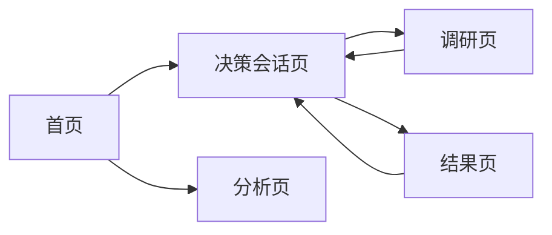

# GUI 工作台设计基线与页面拆解

**文档日期**：2026-04-08  
**文档目的**：沉淀当前已确认的中文 GUI 工作台基线，并在此基础上继续拆解首页、调研页、结果页，以及前端组件与页面区块清单  
**适用范围**：后续页面设计、前端拆分、产品评审、设计迭代

---

## 1. 当前结论

当前已确认的中文版三栏工作台设计，可以作为第一版 GUI 的**视觉与信息架构基线**。

它已经满足以下关键要求：

- 不是聊天页面，而是工作台
- 有明确阶段导航
- 有候选方案比较区
- 有证据区
- 有当前建议区
- 有风险与待确认项
- 有用户动作入口

这意味着：

- 这张图不再作为“尝试方向”
- 而是作为“已确认基线”
- 后续首页、调研页、结果页都应该围绕这张图的结构语言展开

---

## 2. 已确认的设计基线

## 2.1 基线定位

当前基线对应的是系统中最核心的页面：

**决策会话工作台 / 比较与评估阶段页**

它代表的是：

- 第一版主工作区的结构
- 三栏控制台布局
- 信息组织优先级
- 工作台而非聊天页的产品心智

## 2.2 已确认的结构

### 顶部导航

- 产品名：`决策工作台`
- 导航：`会话 / 调研 / 结果 / 分析`
- 搜索框
- 新建会话按钮
- 通知 / 设置 / 头像入口

### 左侧栏

- 当前项目/会话
- 四阶段垂直流程
- 当前阶段高亮
- 待处理事项
- 底部快捷入口

### 中间主区

- 当前阶段标题与状态
- 模型摘要区
- 候选方案卡片
- 对比矩阵

### 右侧栏

- 关键证据
- 当前建议
- 风险
- 待确认项
- 导出报告入口

## 2.3 这张图成立的根本原因

它不是因为“好看”，而是因为它解决了结构问题：

1. 阶段信息被固定在左侧，不会丢
2. 当前阶段工作集中在中间，不会分散
3. 证据、建议、风险固定在右侧，不会埋进正文
4. 候选方案以比较为核心，而不是以聊天为核心
5. 多模型参与被展示成“结构化摘要”，而不是聊天对话流

---

## 3. 基于工作台的页面体系拆解

第一版建议的页面体系仍然保持 5 页：

1. 首页
2. 决策会话页
3. 调研页
4. 结果页
5. 分析页

其中：

- 决策会话页已经有明确基线
- 现在主要补齐首页、调研页、结果页

---

## 4. 首页拆解

## 4.1 页面定位

首页不是营销首页，而是**工作入口页**。

它的职责不是介绍产品，而是让用户快速进入工作状态。

## 4.2 页面目标

- 快速看到最近会话
- 快速创建新会话
- 快速看到最近的调研主题和结果
- 快速进入还没处理完的工作

## 4.3 信息架构

### 顶部

- 产品名
- 顶部导航
- 搜索
- 新建会话

### 主区上半部分

#### 左侧：最近会话

- 会话标题
- 当前阶段
- 最后更新时间
- 状态

#### 右侧：推荐继续处理

- 待继续的会话卡片
- 进入按钮

### 主区下半部分

#### 左侧：最近调研

- 最近分析的开源项目
- 最近论文
- 最近保留的启发点

#### 右侧：最近决策建议

- 最近生成的建议卡片
- 关联会话
- 推荐方向摘要

## 4.4 首页应强调什么

- 工作连续性
- 最近上下文
- 下一步入口

## 4.5 首页不应做什么

- 不做大 banner
- 不做品牌宣传首页
- 不做过多图表

---

## 5. 调研页拆解

## 5.1 页面定位

调研页是**证据与外部参考工作区**。

它服务于：

- 开源项目分析
- 论文摘要
- 对比结论沉淀

## 5.2 页面目标

- 管理调研对象
- 对调研对象做可借鉴/不建议借鉴判断
- 让调研结论能回流到候选方案与当前建议

## 5.3 信息架构

### 左侧

- 调研对象分类
- 来源筛选
- 标签筛选

### 中间主区

- 调研对象卡片列表
- 每个卡片展示：
  - 名称
  - 来源
  - 定位
  - 核心结论
  - 标签：可借鉴 / 谨慎借鉴 / 不建议借鉴

### 右侧详情区

- 当前选中对象详情
- 借鉴点
- 不建议借鉴点
- 可落位阶段
- 关联候选方案

## 5.4 调研页的关键价值

- 把“研究”从临时聊天记录里抽出来
- 把“启发”变成结构化资产

---

## 6. 结果页拆解

## 6.1 页面定位

结果页是**决策建议的结构化展示页**。

它不是再次工作，而是查看和输出当前结论。

## 6.2 页面目标

- 清晰展示当前推荐方案
- 呈现推荐依据
- 呈现备选方案
- 呈现风险与待确认项
- 支持导出

## 6.3 信息架构

### 顶部

- 会话标题
- 结果状态
- 导出按钮

### 中间主区

#### 区块 1：推荐方案

- 方案名称
- 一句话摘要
- 推荐理由

#### 区块 2：备选方案

- 备选项列表
- 为什么没被选中

#### 区块 3：下一步建议

- 立即动作
- 后续验证动作

### 右侧

- 关键证据摘要
- 风险
- 待确认项
- 决策路径摘要

## 6.4 结果页的关键价值

- 把“当前建议”从工作台中抽成稳定产物
- 方便给产品经理、项目经理、老板看

---

## 7. 页面间关系

说明：

- 首页是入口
- 决策会话页是主工作区
- 调研页是辅助工作区
- 结果页是结论输出区
- 分析页是后台观察区

---

## 8. 前端组件清单

下面这部分是为了后面做第 2 项准备。

## 8.1 全局组件

- `TopNav`
- `GlobalSearch`
- `CreateSessionButton`
- `UserMenu`
- `NotificationButton`

## 8.2 会话与流程组件

- `SessionList`
- `SessionCard`
- `StageStepper`
- `StageStatusBadge`
- `AttentionPanel`

## 8.3 工作台核心组件

- `StageHeader`
- `ModelSummaryPanel`
- `ModelSummaryCard`
- `CandidateOptionCard`
- `ComparisonMatrix`
- `CurrentRecommendationCard`
- `RiskList`
- `OpenQuestionList`

## 8.4 调研组件

- `ResearchFilterBar`
- `ResearchItemCard`
- `ResearchDetailPanel`
- `EvidenceTag`
- `EvidenceSummaryList`

## 8.5 结果组件

- `RecommendationHero`
- `AlternativeOptionList`
- `DecisionPathSummary`
- `ExportReportButton`

## 8.6 分析组件

- `MetricCard`
- `StageFunnelChart`
- `TopTopicsList`
- `ModelUsagePanel`

---

## 9. 页面区块清单

## 9.1 首页区块

- 顶部导航区
- 最近会话区
- 推荐继续处理区
- 最近调研区
- 最近决策建议区

## 9.2 决策会话页区块

- 左侧流程导航区
- 当前阶段标题区
- 模型摘要区
- 候选方案区
- 对比矩阵区
- 证据区
- 当前建议区
- 风险区
- 待确认项区

## 9.3 调研页区块

- 分类筛选区
- 调研卡片区
- 调研详情区

## 9.4 结果页区块

- 推荐方案区
- 备选方案区
- 下一步建议区
- 风险与待确认区
- 决策路径摘要区

## 9.5 分析页区块

- 会话总览区
- 阶段转化区
- 热门主题区
- 模型使用区

---

## 10. 当前建议的下一步顺序

建议后续按这个顺序推进：

1. 固化当前工作台基线
2. 基于这套语言补出首页
3. 补出调研页
4. 补出结果页
5. 再回头统一组件和样式规范

---

## 11. 当前结论

当前最重要的不是继续发散更多页面风格，而是把已经成立的工作台语言稳定下来。

第一版 GUI 的正确推进顺序应该是：

> 先固定核心工作台，再围绕它展开首页、调研页、结果页，最后再统一组件层。

如果压缩成一句话：

> 这张已确认的中文三栏工作台图，已经足够作为第一版 GUI 的母版页面，后续页面都应该从它衍生，而不是另起炉灶。

