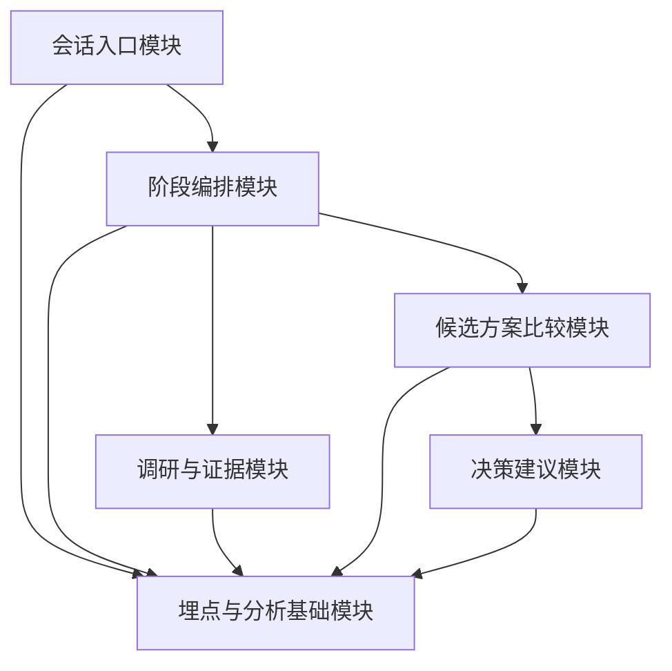
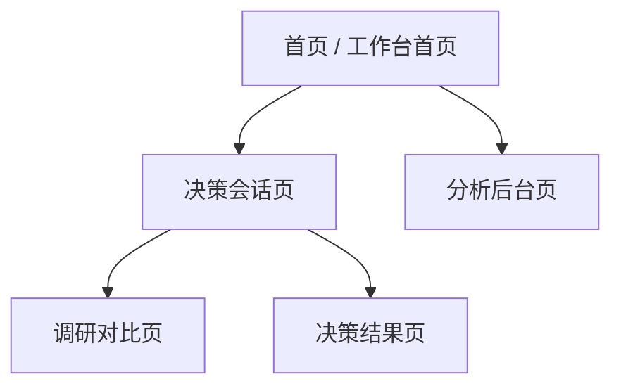

# MVP 模块清单与页面信息架构

**文档日期**：2026-04-08  
**文档目标**：基于当前“多模型决策架构草图”，进一步收敛第一版 MVP 的模块边界、页面信息架构和最小埋点范围  
**适用范围**：第一版产品设计、前后端拆分、页面原型设计、后续排期

---

## 1. 核心判断

第一版 MVP 不应该试图做完整平台，而应该只做一条能跑通的主链路：

> **问题进入 -> 结构化定义 -> 调研/发散 -> 方案比较 -> 决策建议输出 -> 过程数据沉淀**

所以第一版的设计原则是：

- 只保留主线
- 页面围绕主线组织
- 模块围绕主线拆分
- 埋点优先采“阶段路径和决策动作”，不是先采一堆无关行为

---

## 2. 第一版 MVP 目标

第一版 MVP 需要做到：

1. 用户可以新建一个决策会话
2. 系统可以按阶段推进问题
3. 系统可以展示调研结论、候选方案和比较结果
4. 系统可以输出结构化决策建议
5. 系统可以保留会话过程和用户关键操作

第一版不要求做到：

- 完整多租户
- 复杂权限系统
- 高度自治的长期运行 agent
- 自动知识蒸馏
- 完整的商业化后台

---

## 3. MVP 模块总览

建议把第一版拆成 6 个核心模块。



---

## 4. 模块清单

## 4.1 会话入口模块

### 目标

- 让用户创建、查看、继续一个决策会话

### 核心能力

- 新建会话
- 会话标题与摘要生成
- 最近会话列表
- 会话状态展示

### 输入

- 用户原始问题
- 可选标签或主题

### 输出

- `Session`

### P0 必做

- 新建会话
- 会话列表
- 会话详情跳转

### 可后置

- 会话模板
- 会话归档/收藏

## 4.2 阶段编排模块

### 目标

- 严格控制问题如何从阶段 1 推到阶段 4

### 核心能力

- 当前阶段状态管理
- 阶段推进
- 阶段重跑
- 阶段回退
- 角色化模型路由

### 输入

- Session
- 当前阶段产物

### 输出

- `StageRun`
- 阶段产物快照

### P0 必做

- 问题定义
- 调研与发散
- 比较与评估
- 决策收敛

### 可后置

- 自动化回退规则
- 阶段依赖条件编辑

## 4.3 调研与证据模块

### 目标

- 管理外部参考、开源项目分析、论文摘要和证据片段

### 核心能力

- 添加调研对象
- 保存调研结论
- 标记“可借鉴 / 不建议借鉴”
- 关联到某个候选方案

### 输入

- 开源项目
- 论文
- 用户补充材料

### 输出

- `ResearchItem`
- `Evidence`

### P0 必做

- 调研对象卡片
- 调研摘要
- 可借鉴/不建议借鉴

### 可后置

- 自动网页抓取
- 自动证据聚类

## 4.4 候选方案比较模块

### 目标

- 让方案比较成为明确动作，而不是散落在聊天中

### 核心能力

- 创建候选方案
- 编辑候选方案
- 对比矩阵
- 风险点记录
- 评分维度占位

### 输入

- 阶段二产出的候选方向
- 调研证据

### 输出

- `CandidateOption`
- `OptionComparison`

### P0 必做

- 候选方案卡片
- 对比表
- 风险记录

### 可后置

- 自定义权重评分
- 可视化排序

## 4.5 决策建议模块

### 目标

- 形成第一版最重要的主输出

### 核心能力

- 生成推荐方案
- 展示推荐理由
- 展示备选方案
- 展示风险与待确认项
- 展示下一步建议

### 输入

- 比较结果
- 风险点
- 多模型收敛结果

### 输出

- `DecisionRecommendation`

### P0 必做

- 推荐方案
- 推荐理由
- 风险与待确认项
- 下一步行动建议

### 可后置

- 多版本推荐对比
- 导出决策简报 PDF

## 4.6 埋点与分析基础模块

### 目标

- 为后续数据分析、产品迭代和知识沉淀留出基础

### 核心能力

- 记录会话级行为
- 记录阶段级行为
- 记录决策关键动作
- 记录模型调用结果

### 输出

- `UserAction`
- `ModelInvocation`
- `UsageMetric`

### P0 必做

- 会话创建
- 阶段完成
- 候选方案新增/删除
- 推荐方案采纳/不采纳
- 模型调用基础记录

### 可后置

- 热点问题聚类
- 自动洞察报告

---

## 5. 第一版模块优先级

## 5.1 P0 必做

- 会话入口模块
- 阶段编排模块
- 调研与证据模块
- 候选方案比较模块
- 决策建议模块
- 埋点与分析基础模块

## 5.2 P1 应补强

- 页面导出能力
- 自定义比较维度
- 调研对象批量整理
- 阶段回退体验优化

## 5.3 P2 后续拓展

- 用户权限管理
- 团队协作评论
- 高级统计后台
- 知识蒸馏

---

## 6. 页面信息架构

第一版建议采用 **4 个主页面 + 1 个后台页** 的结构。



---

## 7. 页面清单与职责

## 7.1 页面一：工作台首页

### 页面目标

- 让用户快速进入和管理会话

### 页面区块

#### 顶部

- 产品名称
- 全局搜索入口
- 新建会话按钮

#### 中部左侧

- 最近会话列表
- 会话状态标记

#### 中部右侧

- 最近生成的决策建议
- 最近调研主题

#### 底部

- 常见问题类型占位
- 推荐继续处理的会话

### P0 必须展示的信息

- 会话标题
- 当前阶段
- 最后更新时间
- 当前状态

### 对应模块

- 会话入口模块
- 埋点模块

## 7.2 页面二：决策会话页

### 页面目标

- 这是整个系统的核心工作台

### 页面结构

#### 左侧栏

- 阶段导航
- 会话信息
- 当前阶段状态

#### 中间主区

- 当前阶段说明
- 模型执行结果
- 候选方案区
- 可编辑摘要区

#### 右侧栏

- 证据摘要
- 当前结论
- 风险与待确认项

### P0 必须展示的信息

- 当前阶段
- 当前阶段角色与模型
- 阶段结果
- 候选方案
- 关键证据

### 对应模块

- 阶段编排模块
- 调研与证据模块
- 候选方案比较模块

## 7.3 页面三：调研对比页

### 页面目标

- 把调研材料和外部项目分析集中展示

### 页面结构

#### 顶部

- 当前主题
- 过滤器

#### 主区

- 调研对象卡片列表
- 每张卡片显示：
  - 名称
  - 来源
  - 定位
  - 可借鉴点
  - 不建议借鉴点
  - 适合落位阶段

#### 右侧

- 当前被选中的调研对象详情

### P0 必须展示的信息

- 调研对象名称
- 核心结论
- 可借鉴 / 不建议借鉴
- 对当前产品的启发

### 对应模块

- 调研与证据模块

## 7.4 页面四：决策结果页

### 页面目标

- 用结构化方式展示最终建议

### 页面结构

#### 顶部

- 会话标题
- 当前结论状态
- 导出按钮占位

#### 主区

- 推荐方案
- 推荐理由
- 备选方案
- 风险清单
- 待确认事项
- 下一步行动建议

#### 侧边区

- 决策路径摘要
- 关键证据入口

### P0 必须展示的信息

- 推荐方案
- 为什么推荐
- 哪些点还不确定
- 下一步怎么做

### 对应模块

- 决策建议模块

## 7.5 页面五：分析后台页

### 页面目标

- 给后续运营和产品迭代提供最基础的数据视图

### 第一版只做最基础看板

#### 区块

- 会话数量
- 阶段完成率
- 热门主题
- 推荐方案采纳率
- 模型调用次数
- 粗粒度成本视图

### P0 必须展示的信息

- 会话数
- 阶段转化
- 模型调用总量

### 对应模块

- 埋点与分析基础模块

---

## 8. 导航结构建议

建议第一版主导航如下：

- `首页`
- `会话`
- `调研`
- `结果`
- `分析`

更细一点的页面路由可以先按：

```text
/
/sessions
/sessions/:sessionId
/research
/sessions/:sessionId/result
/analytics
```

---

## 9. 页面与模块映射关系

| 页面 | 主要模块 |
|------|----------|
| 工作台首页 | 会话入口、埋点 |
| 决策会话页 | 阶段编排、调研与证据、候选方案比较 |
| 调研对比页 | 调研与证据 |
| 决策结果页 | 决策建议 |
| 分析后台页 | 埋点与分析基础 |

---

## 10. 第一版最小埋点范围

你特别提醒的这部分，第一版必须留口子，不能忘。

## 10.1 埋点原则

- 先采结构化关键动作
- 先采路径，不先采全量原文
- 先支持产品分析，不先做复杂行为画像

## 10.2 P0 事件清单

### 会话级事件

- `session_created`
- `session_opened`
- `session_resumed`

### 阶段级事件

- `stage_started`
- `stage_completed`
- `stage_rerun_requested`
- `stage_rollback_requested`

### 候选方案事件

- `candidate_created`
- `candidate_updated`
- `candidate_deleted`
- `candidate_promoted_to_recommendation`

### 决策事件

- `recommendation_generated`
- `recommendation_accepted`
- `recommendation_rejected`
- `recommendation_exported`

### 模型调用事件

- `model_invocation_started`
- `model_invocation_completed`
- `model_invocation_failed`

## 10.3 埋点必须带的字段

建议最少带：

```ts
{
  sessionId,
  stage,
  eventName,
  actorType,
  actorId,
  modelProvider,
  modelName,
  role,
  timestamp
}
```

## 10.4 第一版暂不默认采的内容

- 用户输入全文上传
- 模型输出全文上传
- 推理链上传
- 附件全文上传

这些后续再做分层策略。

---

## 11. 建议的后端实体

第一版建议至少有这些实体：

```ts
Session
StageRun
ResearchItem
Evidence
CandidateOption
DecisionRecommendation
UserAction
ModelInvocation
UsageMetric
```

---

## 12. 第一版实施顺序建议

### 第一步

- 首页
- 会话创建
- 决策会话页骨架

### 第二步

- 阶段编排
- 候选方案展示
- 调研证据展示

### 第三步

- 决策结果页
- 最小埋点
- 分析后台页基础数据

---

## 13. 当前结论

基于当前支点项目和已确认方向，第一版 MVP 应聚焦：

- 一个可用的决策工作台
- 一条完整的阶段式主链路
- 一套最小但结构化的模块拆分
- 一组后续可扩展的埋点基础

如果压缩成一句话：

> 第一版先把“决策工作台”做出来，再让“后台和分析能力”跟着主链路自然生长，而不是一开始铺成一个大而全的平台。

