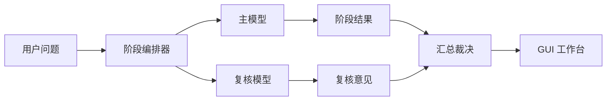
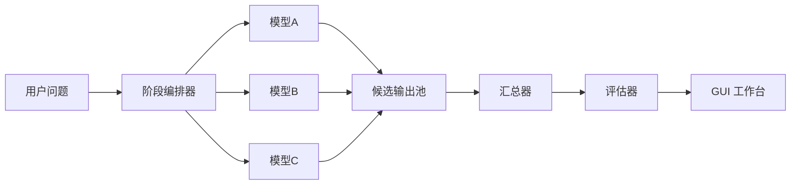
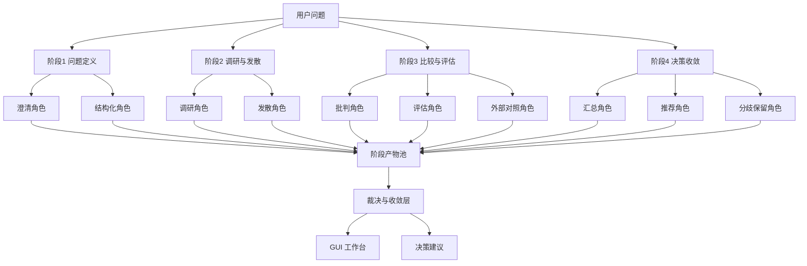
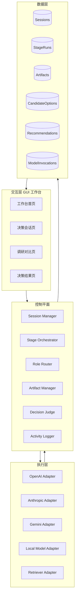
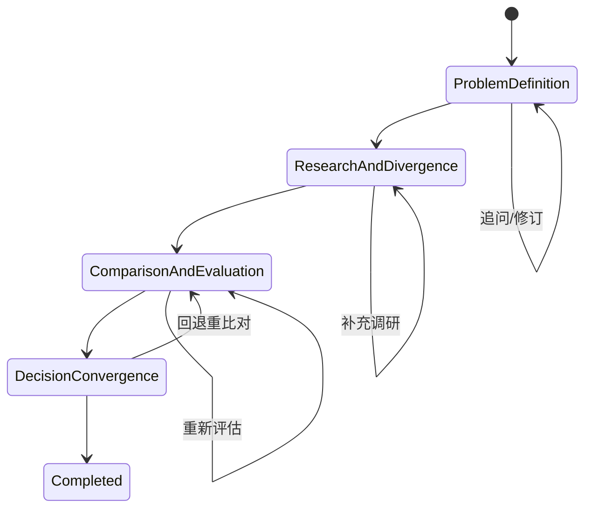

# 多模型决策架构草图

**文档日期**：2026-04-08  
**文档目标**：在当前已调研的 MIDAS、AegisFlow、Trellis、Paperclip 基础上，收敛出第一版“渐进式 AI 决策支持系统”的多模型决策架构草图  
**适用范围**：第一版架构讨论、技术选型、界面设计、后端建模

---

## 1. 核心判断

第一版不适合直接做“自治型多 agent 公司系统”，也不适合退回成“单模型聊天助手”。

更稳妥的架构方向是：

> **阶段式编排 + 角色化多模型 + 汇总裁决 + GUI 工作台**

也就是说：

- 用阶段控制流程，避免无限发散
- 用多模型承担不同角色，避免单模型偏见
- 用统一裁决层收敛结果，避免各说各话
- 用 GUI 工作台承载阶段、证据、候选方案和结论

---

## 2. 设计目标

本架构必须支持以下目标：

1. 用户输入一个模糊问题后，系统能分阶段推进，而不是一次性吐一堆答案
2. 不同模型可以在同一阶段承担不同角色
3. 系统能保留候选方案、证据、分歧和最终建议
4. GUI 能清楚展示当前阶段、模型参与情况、候选方案和结论
5. 后续能扩展到项目经理、产品经理等角色，而不是只服务开发者自己

---

## 3. 三种可选架构

## 3.1 方案 A：单主模型 + 复核模型

### 思路

- 一个主模型负责主要产出
- 一个复核模型负责补充风险、指出缺口、做质量校验

### 架构示意



### 优点

- 最简单
- 成本最低
- 容易调试

### 缺点

- 方案多样性不足
- 一旦主模型偏差较大，复核模型只能事后纠偏
- 对“多模型决策”的价值展示不够强

### 适用性

- 适合最小 MVP
- 但不完全匹配你当前想做的“多模型参与决策”

## 3.2 方案 B：并行多模型生成 + 汇总裁决

### 思路

- 同一阶段多个模型并行工作
- 每个模型给出自己的产出
- 汇总器统一整合
- 裁决器生成阶段结论

### 架构示意



### 优点

- 多样性强
- 易比较模型差异
- 更贴近“多模型决策”

### 缺点

- 成本高
- 输出冲突更明显
- 第一版容易过重

### 适用性

- 适合中期版本
- 第一版直接这么做，风险偏高

## 3.3 方案 C：阶段式编排 + 角色化多模型 + 汇总裁决

### 思路

- 每个阶段有明确目标
- 同一阶段允许多个模型参与，但不是无差别并行
- 给模型分角色，而不是只分模型名
- 最后由汇总裁决层统一收口

### 架构示意



### 优点

- 最贴合你现在的目标
- 保留多模型价值，又不至于变成失控自治系统
- 适合阶段式 GUI 工作台
- 更方便后续评估“哪个模型适合哪个阶段”

### 缺点

- 比方案 A 复杂
- 需要更清晰的角色定义和编排逻辑

### 适用性

- **最适合你们第一版**

---

## 4. 推荐方案

推荐采用 **方案 C：阶段式编排 + 角色化多模型 + 汇总裁决**。

### 原因

1. 它和你当前确认的主线完全一致：
   `需求梳理 -> 调研分析 -> 方案比较 -> 决策建议`
2. 它吸收了 MIDAS 的“渐进式 ideation”，而不是只抄多 agent 数量
3. 它能借鉴 Paperclip 的控制平面，但不会掉进“自治公司”叙事
4. 它天然适合做 GUI 工作台，而不是纯 chat

---

## 5. 推荐架构的核心分层

建议把系统拆成 4 层。

## 5.1 交互层

负责：

- 接收用户输入
- 展示阶段流转
- 展示候选方案与证据
- 展示最终建议

组件建议：

- `Decision Workspace`
- `Research Compare View`
- `Recommendation View`
- `Run Status Panel`

## 5.2 控制平面

这是系统核心。

负责：

- 创建和管理决策会话
- 推进阶段
- 调度模型角色
- 管理阶段产物
- 汇总和裁决

组件建议：

- `Session Manager`
- `Stage Orchestrator`
- `Role Router`
- `Artifact Manager`
- `Decision Judge`
- `Activity/Audit Logger`

## 5.3 执行层

负责：

- 调用不同模型
- 标准化输入输出
- 返回结构化结果

组件建议：

- `OpenAI Adapter`
- `Anthropic Adapter`
- `Gemini Adapter`
- `Local Model Adapter`
- `Retriever Adapter`

## 5.4 数据层

负责：

- 存储会话
- 存储阶段产物
- 存储候选方案与结论
- 存储运行记录

组件建议：

- PostgreSQL
- 对象存储或文件存储（后续放原始 trace）

---

## 6. 推荐架构总图



---

## 7. 阶段与模型角色设计

## 7.1 阶段一：问题定义

### 目标

- 把模糊问题变成结构化问题

### 建议角色

- `Clarifier`
  负责提出追问，补足上下文
- `Structurer`
  负责整理成需求简报

### 产物

- 问题摘要
- 目标
- 约束
- 非目标
- 成功标准

## 7.2 阶段二：调研与发散

### 目标

- 找到可借鉴的案例和候选方向

### 建议角色

- `Researcher`
  负责分析开源项目、论文、案例
- `Divergent Thinker`
  负责扩展可行方向

### 产物

- 调研结论
- 候选方向清单
- 初步启发点

## 7.3 阶段三：比较与评估

### 目标

- 对候选方案做有依据的比较

### 建议角色

- `Critic`
  负责指出缺陷、盲点和风险
- `Evaluator`
  负责按统一维度给出比较
- `Benchmark Checker`
  负责做外部对照

### 产物

- 对比矩阵
- 风险清单
- 评分结果

## 7.4 阶段四：决策收敛

### 目标

- 形成可解释的决策建议

### 建议角色

- `Synthesizer`
  负责归纳共识
- `Recommender`
  负责给出推荐
- `Dissent Recorder`
  负责保留分歧和未确认项

### 产物

- 推荐方案
- 推荐理由
- 风险提示
- 待确认事项
- 下一步行动建议

---

## 8. 阶段控制逻辑

建议第一版不要让模型自由跳阶段，而是由 `Stage Orchestrator` 严格控制。

### 基本规则

1. 只有当前阶段完成，才能进入下一阶段
2. 每个阶段必须有结构化产物
3. 如果阶段产物不完整，可以重跑当前阶段，不直接跳过
4. 用户可以人工编辑阶段摘要和候选方案
5. 模型输出只是输入给裁决层的候选内容，不直接等于最终结果

### 状态机建议



---

## 9. 控制平面的关键组件说明

## 9.1 Session Manager

负责：

- 创建会话
- 维护会话状态
- 关联当前阶段

### 核心实体

```ts
Session {
  id
  title
  initialQuestion
  currentStage
  status
}
```

## 9.2 Stage Orchestrator

负责：

- 决定某阶段调用哪些角色
- 管理该阶段的执行顺序
- 控制重试和回退

### 作用

这是整个架构的“流程大脑”。

## 9.3 Role Router

负责：

- 把角色映射到具体模型
- 支持阶段差异化路由

### 例子

```ts
{
  problem_definition: {
    clarifier: "gpt-4.1",
    structurer: "claude"
  },
  comparison_evaluation: {
    critic: "claude",
    evaluator: "gpt-4.1",
    benchmark_checker: "gemini"
  }
}
```

## 9.4 Artifact Manager

负责：

- 存储阶段产物
- 维护候选方案版本
- 关联证据来源

## 9.5 Decision Judge

负责：

- 汇总多模型结果
- 生成结构化结论
- 保留分歧信息

这个组件不能只是“再调一个模型总结”，而要尽量用结构化规则加模型结合。

---

## 10. 第一版推荐的运行模式

## 10.1 第一版不要全并行

建议：

- 阶段内局部并行
- 阶段间严格串行

### 原因

- 阶段间有明显顺序依赖
- 第一版更需要稳定和可解释，而不是极限并行

## 10.2 第一版推荐模式

### 问题定义阶段

- 串行：`Clarifier -> Structurer`

### 调研与发散阶段

- 并行：`Researcher || Divergent Thinker`

### 比较与评估阶段

- 并行：`Critic || Evaluator || Benchmark Checker`

### 决策收敛阶段

- 串行：`Synthesizer -> Recommender -> Dissent Recorder`

---

## 11. GUI 对应关系

多模型架构一定要和 GUI 一起设计，否则工作台会失真。

## 11.1 工作台必须展示的内容

- 当前阶段
- 当前阶段参与的模型与角色
- 已产出的候选方案
- 当前证据列表
- 当前阶段的系统结论
- 用户可编辑内容

## 11.2 推荐 UI 结构

### 左侧

- 阶段导航
- 会话目录

### 中间

- 当前阶段输出
- 候选方案
- 对比内容

### 右侧

- 证据摘要
- 模型角色状态
- 当前结论
- 风险与待确认项

---

## 12. 第一版技术边界

## 12.1 应做

- 会话与阶段管理
- 角色化模型路由
- 结构化阶段产物
- 候选方案比较
- 汇总裁决
- GUI 工作台

## 12.2 后置

- 自动长期运行
- 高级自治调度
- 复杂插件系统
- 组织级审批体系
- 自动知识蒸馏

---

## 13. 实现优先级建议

### P0

- Session Manager
- Stage Orchestrator
- Role Router
- Decision Workspace GUI

### P1

- Artifact Manager
- Candidate Option Compare
- Recommendation View

### P2

- 模型路由优化
- 成本视图
- 反馈与评估闭环

---

## 14. 当前最大风险

1. 如果角色定义过多，第一版会过重
2. 如果裁决层太弱，会变成“多模型同时说废话”
3. 如果阶段边界不清，GUI 会退化成聊天壳
4. 如果模型路由设计太死，后续试错成本高

---

## 15. 当前建议结论

基于当前已有需求和支点项目，第一版多模型决策架构建议如下：

- 总体架构：`交互层 + 控制平面 + 执行层 + 数据层`
- 推荐方案：`阶段式编排 + 角色化多模型 + 汇总裁决`
- 阶段关系：阶段间串行，阶段内按需局部并行
- GUI 形态：工作台，而不是纯聊天页
- 后续重点：在不扩大战线的前提下，把控制平面先做稳

如果压缩成一句话：

> 第一版要做的不是“让更多模型一起说话”，而是“让不同模型在正确阶段承担正确角色，并把结果收敛成可解释的决策建议”。

